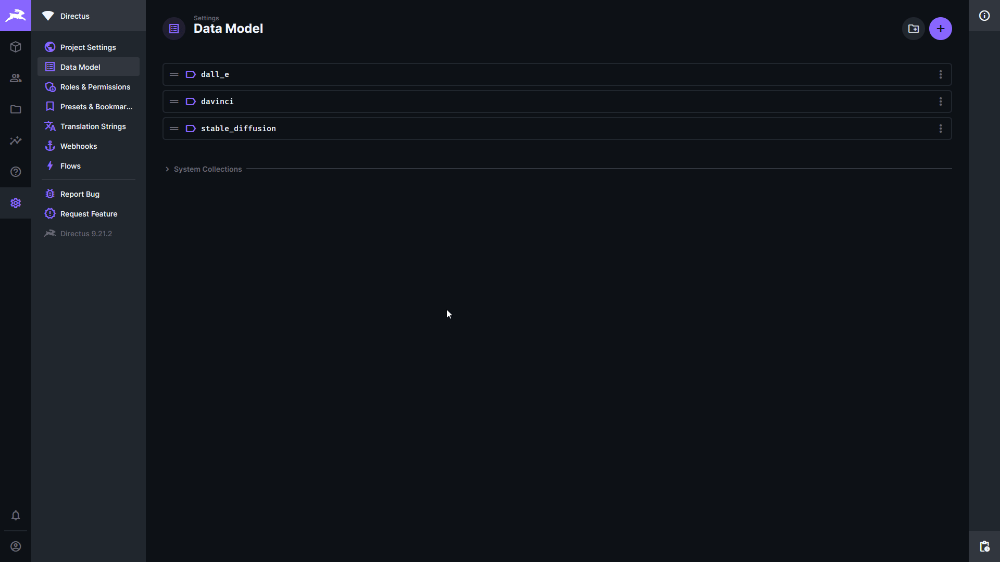
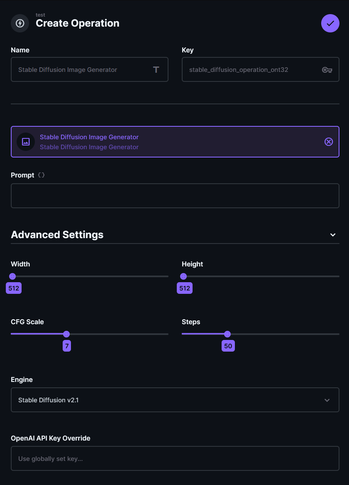
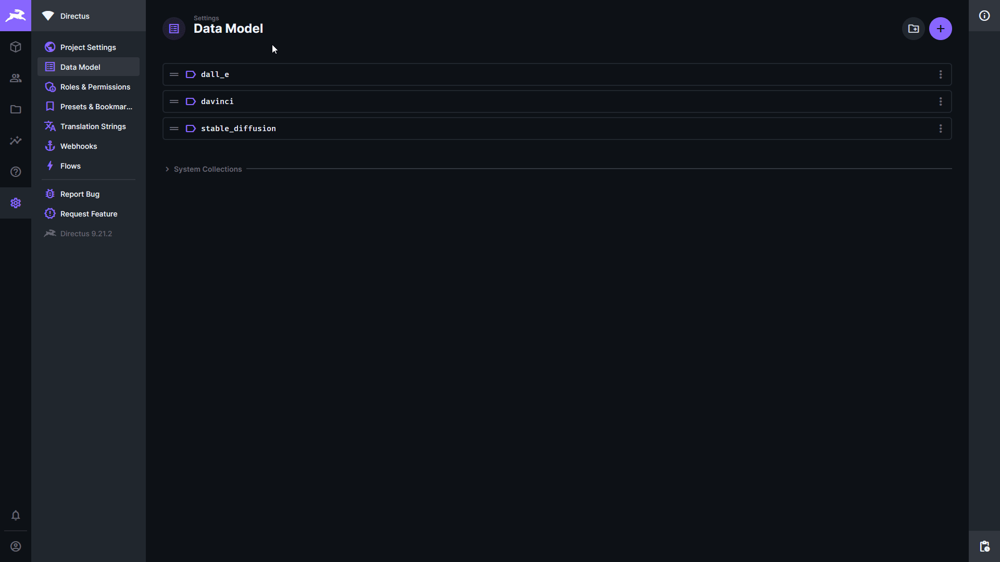
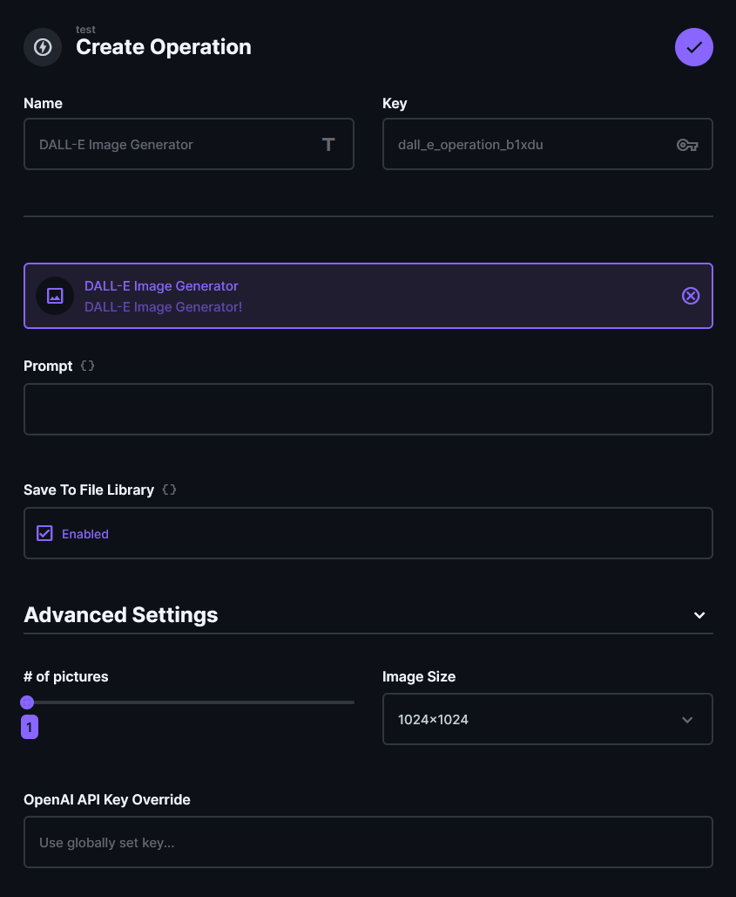
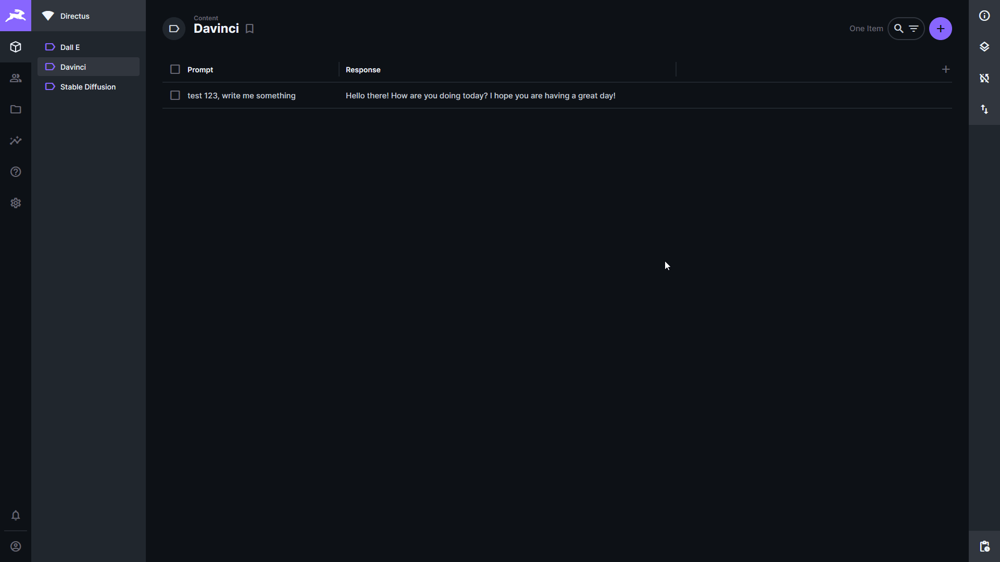
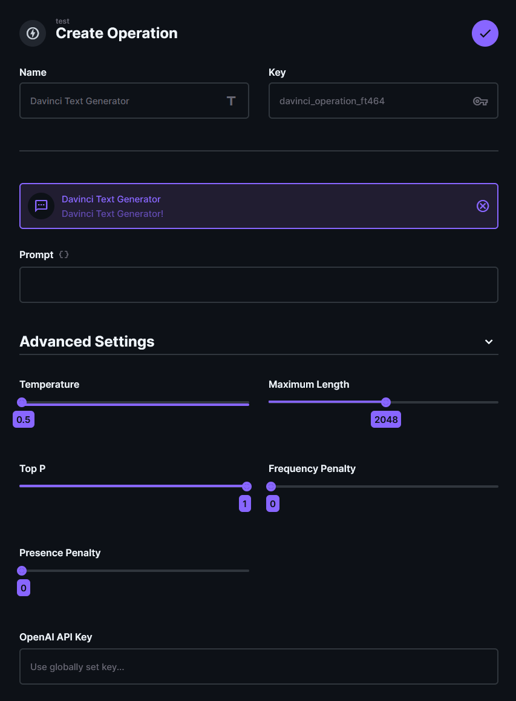
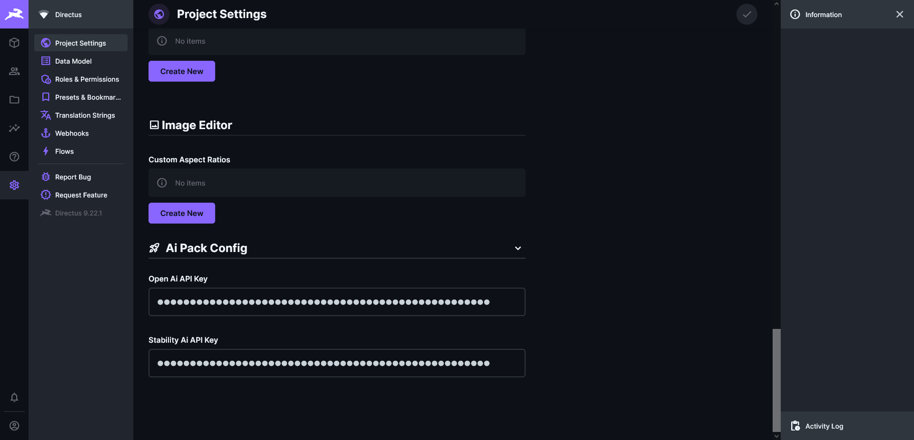

# Directus AI Operations Bundle

A small bundle of Flow Operations which enable interaction with the [OpenAI](https://beta.openai.com/overview) and [Stability](https://stability.ai/) API's.

> Note: To use these you will need an API Key for the respective services.

> Tested with Directus 9.23.4

## Installation

The package is published to npm:
`npm install directus-extension-ai-operation-bundle`

**Manual Installation**
- Download or fork the repository
- Install the requirements\
  `npm install`
- Build the extension\
  `npm run build`
- Move the entire project to your extension folder (only the `package.json` and `dist` folder are strictly necessary)\
  `mv ./ extensions/directus-extension-ai-operation-bundle`
- Restart your Directus instance

## Bundle Content

### Stable Diffusion Operation

This operation allow you generate images from text using the Stable Diffusion models with the [Stability.ai API](https://platform.stability.ai/) taking a `prompt` as input and saves the resulting image to the file library returning its ID as output.


**Output**\
An object containing the ID of the resulting image file.
```json
{ "id": "[UUID]" }
```

**Configuration Options**\
I am by no means an expert in what any of these model specific settings do so please check out the [stability docs](https://api.stability.ai/docs) for that.
1. `Prompt` This is the main text input used for generating the image.
2. `Width` Width of the image (note: height * width must be <= 1 Megapixel)
3. `Height` Height of the image (note: height * width must be <= 1 Megapixel)
4. `CFG Scale` How strictly the diffusion process adheres to the prompt text (higher values keep your image closer to your prompt)
5. `Steps` Number of diffusion steps to run
6. `Engine` The model to be used (defined choices can be found in [src/lib/constants.js](src/lib/constants.js)
7. `API Key Override` Used to set an API Key to be used specificly on this operation.



### DALL-E Operation

Similar to the Stable Diffusion operation this allows you to generate images from text but using the OpenAI DALL-E models instead with the [OpenAI API](https://beta.openai.com/docs/guides/images) taking a `prompt` as input, optionally saves it to the local file library and returning both the original URL and local image file ID.


**Output**\
An object containing the ID(s) and URL(s) of the resulting image file(s).
For a single result:
```json
{ "url": "https://some.url", "id": "[UUID]" }
```
For multiple results:
```json
{ "url": ["https://some.url","https://some.other.url"], "id": ["[UUID]","[UUID]"] }
```

**Configuration Options**
1. `Prompt` This is the main text input used for generating the image.
2. `Save To File Library` Disable importing the image into the local storage allowing you to use the DALL-E result URL for other systems.
3. `Number of pictures` DALL-E allows you to generate up to 10 images.
4. `Image Size` Choices are `256x256`, `512x512` or `1024x1024`
5. `API Key Override` Used to set an API Key to be used specificly on this operation.



### GPT-3 Davinci Operation

This operation allows text completion using the OpenAI Davinci models with the [OpenAI API](https://beta.openai.com/docs/guides/completion/introduction) taking a `prompt` as input and returns the generated text.


**Output**\
An object containing the generated text:
```json
{ "response": "Generated TEXT" }
```

**Configuration Options**\
I am by no means an expert in what any of these model specific settings do so please check out the [OpenAI docs](https://beta.openai.com/docs/guides/completion) for that.
1. `Prompt` This is the main text input used for text completion.
2. `Temperature` Controls randomness: Lowering results in less random completions.
3. `Maximum Length` The maximum number of tokens to **generate**. Requests can use up to 2,048 or 4,000 tokens shared between prompt and completion.
4. `Top P` Controls diversity via nucleus sampling: 0.5 means hald of all likelihood-weighted options are considered.
5. `Frequency Penalty` How much to penalize new tokens based on their existing frequency in the text so far. Decreases the models likelihood to repeat the same line verbatim.
6. `Presence Penalty` How much to penalize new tokens based on whether they appear in the text so far. Increases the models likelihood to talk about new topics.
7. `API Key Override` Used to set an API Key to be used specificly on this operation.



### ChatGPT Operation

This operation allows chat text completion using the OpenAI `gpt-3.5-turbo` models with the [OpenAI API](https://platform.openai.com/docs/guides/chat) taking a list of `messages` as input and returns the generated response text.


**Output**\
An object containing the generated text:
```json
{ "response": "Generated chat message" }
```

**Configuration Options**\
Please check out the [OpenAI docs](https://platform.openai.com/docs/guides/chat) for details usage.

1. `Messages` a *json string* list of messages as described in [OpenAI docs](https://platform.openai.com/docs/guides/chat/introduction)
2. `Temperature` Controls randomness: Lowering results in less random completions.
3. `Maximum Length` The maximum number of tokens to **generate**. Requests can use up to 2,048 or 4,000 tokens shared between prompt and completion.
4. `Top P` Controls diversity via nucleus sampling: 0.5 means hald of all likelihood-weighted options are considered.
5. `Frequency Penalty` How much to penalize new tokens based on their existing frequency in the text so far. Decreases the models likelihood to repeat the same line verbatim.
6. `Presence Penalty` How much to penalize new tokens based on whether they appear in the text so far. Increases the models likelihood to talk about new topics.
7. `API Key Override` Used to set an API Key to be used specificly on this operation.

### Configuration Hook

This hook ensures the existence of API Key fields in the Directus Setting. These global settings will be used by the individual operations if not overridden in its local configuration.


